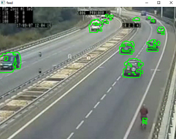
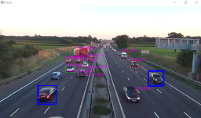
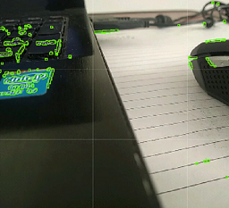
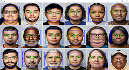
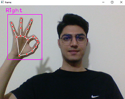
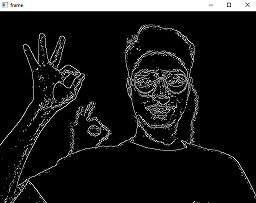

# Object Detection
> In this repository, I tried to use [`OpenCV`](https://opencv.org/) library and implement a few simple projects about object detection and image processing.

## Introduction
Welcome to the Object Detection repository! This collection of Python scripts leverages the power of the OpenCV library to explore various aspects of computer vision, image processing, and real-time detection. Each script in the `./src` folder showcases different applications, ranging from basic motion detection to advanced object recognition and hand tracking.

- `./src/01-ObjectDetection.py`: Introduces a simple motion detection system, utilizing OpenCV to capture video, identify moving objects, and highlight them in real-time.

- `./src/02-ObjectDetectionWithRectangle.py`: Advances the application to include object detection with rectangles, contour identification, and visual annotations in the video stream.

- `./src/03-FindFocusArea.py`: Implements a basic motion detection system to identify focus areas in a video stream, enhancing the understanding of changes in interest.

- `./src/04-FindFaceAndEyesInImage.py`: Demonstrates the use of Haar Cascade classifiers for face and eye detection in images, providing a foundation for broader object identification.

- `./src/05-HandDetection.py`: Explores real-time hand tracking in a webcam feed, utilizing the cvzone library and OpenCV to identify and annotate hands.

- `./src/06-EdgeDetection.py`: Offers a simple demonstration of Canny edge detection in real-time using OpenCV, capturing video from the default camera.

Whether you are interested in the fundamentals of motion detection, object recognition, or real-time tracking, this repository provides a hands-on exploration of computer vision techniques. To get started, follow the usage instructions in the README and dive into the scripts in the `./src` folder. Happy coding!

## Usage
Simply clone the repository and execute the Python files to make use of them. If you wish to replace the images, videos, or XML Haar Cascade files, all you need to do is move your files into the `./data` folder and update the file paths within the specific file you intend to utilize.
```bash
git clone https://github.com/mhrnbzrafkn/ObjectDetection.git
cd ObjectDetection
pip install -r requirements.txt
```

## Project Structure
- `./data`: This folder contains images, videos, or XML Haar Cascade files. Replace these with your own files if needed.

## Demo







## Dependencies
- OpenCV
- cvzone

## Contributing
We welcome contributions! Please [Contact Me](https://www.linkedin.com/in/mehran-bazrafkan/) before making a pull request or raising issues.
